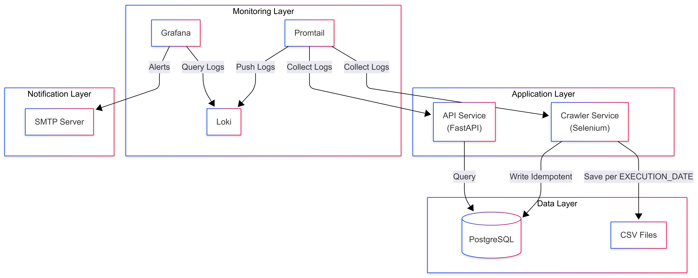
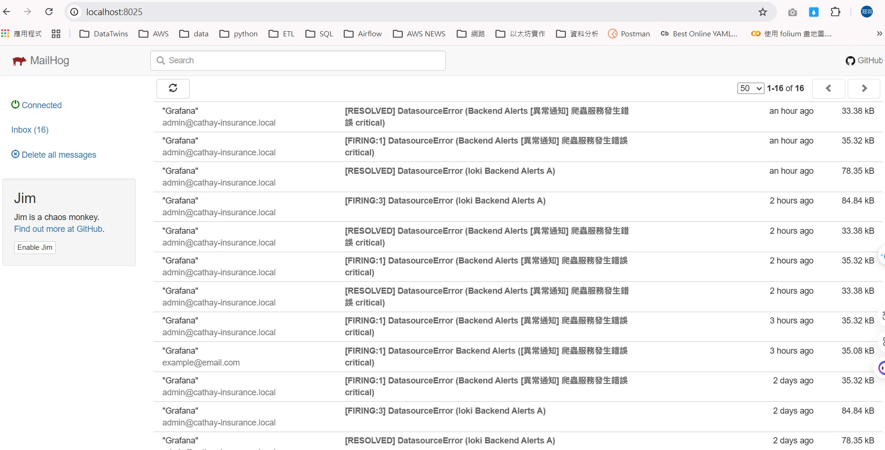
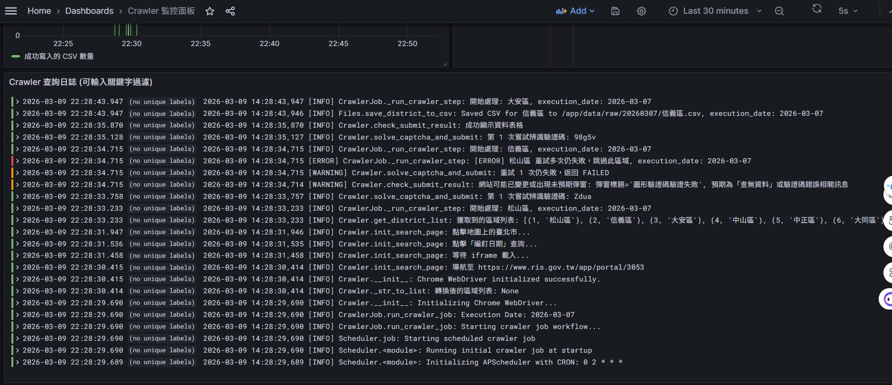
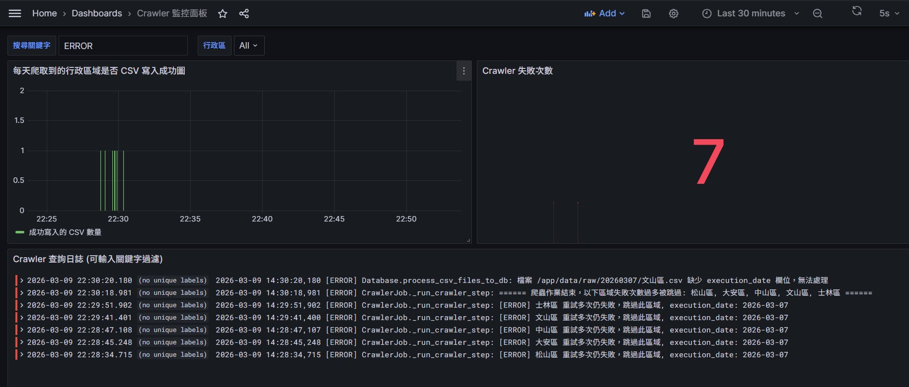
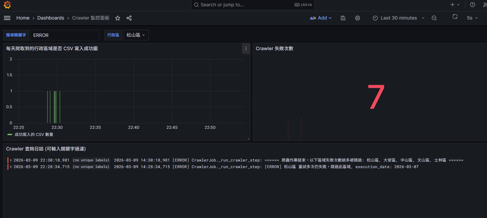
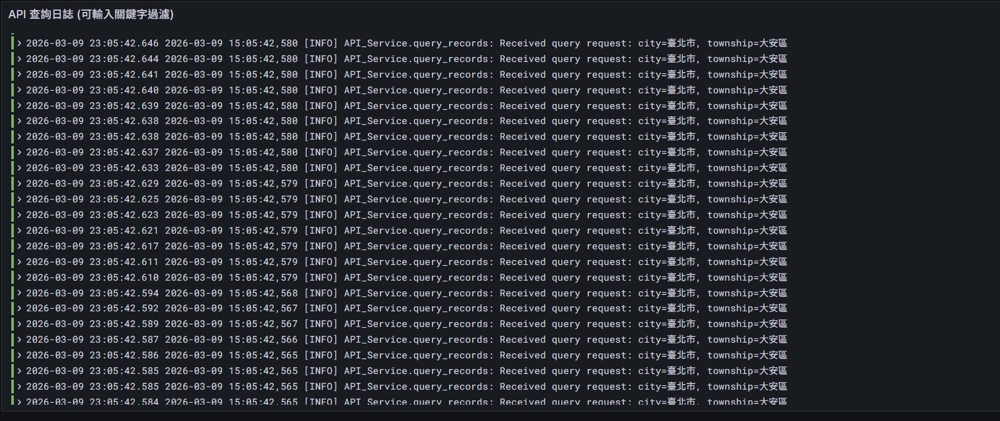
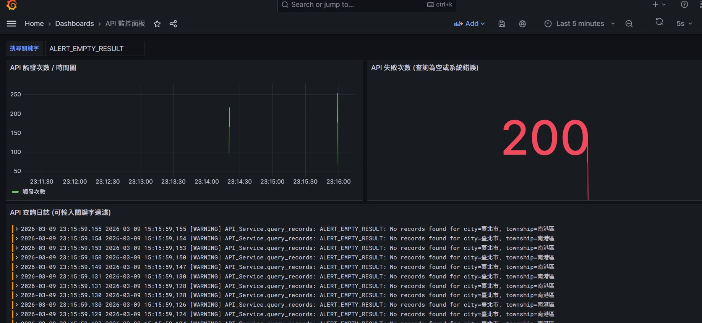

# 爬蟲與 API 微服務專案

本專案依照考題需求，實作包含**爬蟲**、**資料庫**、**API** 以及**日誌監控**四大核心組件的微服務架構，並透過 Docker Compose 進行容器化管理，達到業務服務開發與系統架構串接、自動健檢維運的目標。

---

## 一、整份作業的文件目錄

```
house_number_crawler/
├── README.md                    # 本說明文件
├── docker-compose.yml           # 整體微服務編排設定
├── .env                         # 環境變數（資料庫、排程、Grafana 等）
├── db_init/
│   └── init.sql                # PostgreSQL 初始化腳本（建立 household_records 表）
├── common/                      # 共用模組
│   ├── db.py                   # 資料庫連線引擎
│   └── logger.py               # 日誌設定
├── 試題1_Crawler/               # 試題 1：爬蟲程式
│   ├── get_district_house_no_info.py   # 爬蟲主流程
│   ├── scheduler.py            # 排程設計（APScheduler）
│   ├── Dockerfile
│   ├── requirements.txt
│   ├── utils/
│   │   ├── crawler.py          # Selenium 爬蟲核心
│   │   ├── db.py               # CSV 寫入 DB
│   │   └── files.py            # CSV 儲存與驗證
│   └── data/raw/               # 爬取結果 CSV 輸出目錄
│       └── YYYYMMDD/           # 依執行日期分目錄
│           └── {行政區}.csv
├── 試題2_API/                   # 試題 2：查詢 API
│   ├── main.py                 # FastAPI 查詢端點
│   ├── db.py                   # API 專用資料庫連線與查詢管理
│   ├── Dockerfile
│   └── requirements.txt
├── 試題3_LogMonitor/            # 試題 3：Log 收集與異常通報
│   ├── loki/
│   │   └── local-config.yaml   # Loki 設定
│   ├── promtail/
│   │   └── promtail-config.yaml # Promtail 日誌收集設定
│   └── grafana/
│       └── provisioning/
│           ├── datasources/     # Loki 資料來源
│           ├── alerting/       # 告警規則與聯絡點
│           └── dashboards/      # 儀表板
└── html/                        # 輔助檔案（頁面結構分析用）
```

---

## 二、每項作業與要求說明

### 試題 1：爬蟲程式

#### 作業要求

| 項目 | 說明 |
|------|------|
| **目標網站** | 內政部戶政司 https://www.ris.gov.tw/app/portal/3053 |
| **查詢條件** | 以編釘日期、編釘類別查詢 |
| **縣市** | 台北市 各區 |
| **編訂日期** | 民國 114/09/01 ～ 114/11/30 |
| **編訂類別** | 門牌初編 |
| **資料流程** | 爬取結果**先落檔**（CSV）再寫入資料庫 |
| **Log 紀錄** | 爬蟲執行過程須紀錄成功或失敗的 Log |
| **加分題** | 自動化排程，定期執行資料擷取作業 |

#### 解題邏輯與設計理念

1. **資料擷取**：使用 Selenium 模擬瀏覽器操作，處理 iframe、動態表單與驗證碼（ddddocr），擷取門牌初編查詢結果表格。
2. **資料處理與輸出**：
   - 清理並結構化資料，依行政區與執行日期存成 CSV（路徑：`data/raw/{execution_date}/{行政區}.csv`）。
   - 加入容錯機制，驗證 CSV 產出結果但不中斷流程，**僅將成功產出的 CSV 寫入資料庫**，確保部分區域爬取失敗時，其他成功區域的資料仍能被保留與應用。
3. **冪等性 (Idempotency)**：
   - 支援 `EXECUTION_DATE` 環境變數指定資料日期。
   - 寫入前先執行 `DELETE FROM household_records WHERE ... AND execution_date = ...`，確保同一日期的資料重複執行時會先清除舊資料再寫入，避免重複。
4. **避免 OOM**：使用 `csv.DictReader` 逐行讀取（Generator），搭配 `batch_size=1000` 分批 INSERT，避免一次載入大檔導致記憶體不足。
5. **DB 連線池**：`common/db.py` 透過 `BaseDBManager` 封裝連線邏輯，設定 `pool_size=10`、`max_overflow=20`、`pool_timeout=30`、`pool_pre_ping=True`，控制連線數量並在使用前偵測斷線，並提供統一的 Context Manager (`transaction()`, `connection()`) 管理交易狀態。
6. **單一職責原則 (SRP)**：將爬蟲、檔案 I/O、資料庫寫入解耦，主程式僅負責流程調度。資料庫操作進一步分離出 `BaseDBManager`，由爬蟲與 API 各自繼承實作專屬的管理類別，提高系統擴充性與維護性。
7. **異常處理**：請求失敗、驗證碼辨識失敗、網站結構變更時，記錄 `[ERROR]` 供 Log 監控觸發告警。
8. **技術選型**：選擇 **Selenium** 而非 Requests/Scrapy，因目標網站含 CAPTCHA 與動態渲染，需模擬真實使用者操作。

---

### 試題 2：API 服務

#### 作業要求

| 項目 | 說明 |
|------|------|
| **功能** | 可查詢試題一爬取的資料內容 |
| **輸入** | 縣市 (city)、鄉鎮市區 (township) |
| **輸出** | 符合條件的戶政紀錄列表 |

#### 解題邏輯與設計理念

1. **API 設計**：`POST /query` 接收 JSON，使用 Pydantic 驗證輸入長度，防範惡意過長字串。
2. **SQL Injection 防範**：使用 SQLAlchemy `text()` 搭配參數綁定 (`:city`, `:township`)，避免字串拼接。
3. **查無資料異常**：題目要求「若查詢資料為空發送異常通知」，我們將此情況明確記錄為 `ALERT_EMPTY_RESULT` (Level: WARNING)，由 Grafana 監控並觸發警告通知。
4. **單一職責原則 (SRP) 與連線管理**：API 與爬蟲皆繼承共用的 `BaseDBManager`，確保資料庫連線與錯誤處理機制一致，提高代碼的維護性並避免連線洩漏。

---

### 試題 3：Log 收集器與異常通報

#### 作業要求

| 項目 | 說明 |
|------|------|
| **Log 檢視** | 可檢視試題 1 爬蟲的即時 log、試題 2 API 的查詢紀錄 |
| **異常通知** | 試題 1 爬蟲過程發生異常時發送通知 |
| **異常通知** | 試題 2 查詢資料為空時發送異常通知 |
| **歷史紀錄** | Log 收集需可查詢歷史紀錄 |

#### 解題邏輯與設計理念

1. **開源方案**：採用 **Loki + Promtail + Grafana** 組合。
2. **Log 收集**：Promtail 透過 Docker Socket 收集 `crawler`、`api` 等容器的 stdout/stderr，推送至 Loki。
3. **異常通報**：Grafana Alert Rules 監控特定 Log 關鍵字，觸發時透過 Contact Point（Email）發送通知。
4. **預設通知**：使用 MailHog 模擬 SMTP，可在 `.env` 填入真實 SMTP 以寄送實際信件。

---

### 試題 4：系統架構圖

系統架構圖已繪製於下方「Docker Compose 與整體架構」章節。


---

## 三、啟動與執行方式

### 前置需求

- Docker 與 Docker Compose
- 本機執行爬蟲需 Chrome/Chromedriver 與 Python 3.10+

### 環境變數設定

複製並編輯 `.env`，重點變數如下：

| 變數 | 說明 | 預設值 |
|------|------|--------|
| `POSTGRES_USER` | PostgreSQL 帳號 | (需於 .env 設定) |
| `POSTGRES_PASSWORD` | PostgreSQL 密碼 | (需於 .env 設定) |
| `POSTGRES_DB` | PostgreSQL 資料庫名稱 | house_number_crawler_db |
| `DATABASE_URL` | 完整連線字串（API、爬蟲共用） | (需於 .env 設定) |
| `TARGET_URL` | 戶政司目標網址 | https://www.ris.gov.tw/app/portal/3053 |
| `DISTRICT_LIST` | 指定行政區（留空則爬取台北市全部 12 區） | |
| `CRAWLER_CRON` | 排程 CRON 表達式 | `0 2 * * *`（每天 02:00） |
| `EXECUTION_DATE` | 執行日期 (YYYY-MM-DD)，用於資料夾命名與資料庫冪等性控制 | 系統當日 |
| `GF_SECURITY_ADMIN_USER` | Grafana 登入帳號 | (需於 .env 設定) |
| `GF_SECURITY_ADMIN_PASSWORD` | Grafana 登入密碼 | (需於 .env 設定) |

### 一鍵啟動（推薦）

在專案根目錄執行：

```bash
docker-compose up -d --build
```

此指令會啟動：

- PostgreSQL（5432）
- API 服務（8000）
- Crawler 爬蟲（含排程）
- Loki（3100）、Promtail、Grafana（3000）、MailHog（8025 Web UI）

### 各服務執行方式

#### 1. 爬蟲（試題 1）

- **容器內**：Crawler 容器啟動時會立即執行一次爬取，之後依 `CRAWLER_CRON` 排程執行。
- **本機單次執行**：
  ```bash
  cd 試題1_Crawler
  python get_district_house_no_info.py
  ```
- **本機含排程**：
  ```bash
  python scheduler.py
  ```
- **CSV 輸出**：`試題1_Crawler/data/raw/{execution_date}/{行政區}.csv`

#### 2. API 查詢（試題 2）

API 預設運行於 `http://localhost:8000`。

**查詢範例**：

```bash
curl -X POST http://localhost:8000/query \
  -H "Content-Type: application/json" \
  -d '{"city":"臺北市", "township":"大安區"}'
```

**回傳格式**：

```json
{
  "status": "success",
  "data": [
    {
      "city": "臺北市",
      "township": "大安區",
      "village": "民炤里",
      "neighbor": "013",
      "address": "新生南路一段１５７巷２０號",
      "record_date": "2025-11-07"
    }
  ]
}
```

查無資料時：

```json
{
  "status": "success",
  "data": [],
  "message": "No records found."
}
```

> **注意**：資料庫儲存為「臺北市」（臺），查詢時請使用 `"city":"臺北市"` 以正確匹配。

#### 3. Log 監控與異常通報（試題 3）

- **Grafana**：`http://localhost:3000`（帳號/密碼見 `.env`）
- **MailHog Web UI**：`http://localhost:8025`（檢視模擬寄出的告警信件）

**Log 查詢（Dashboard → 選擇 api/crawler）**：

| 情境 | LogQL 查詢語法 |
|------|----------------|
| 爬蟲錯誤 | `{container="crawler"} \|= "[ERROR]"` |
| API 查無資料 | `{container="api"} \|= "ALERT_EMPTY_RESULT"` |
| API 內部錯誤 | `{container="api"} \|= "ALERT_API_ERROR"` |

**告警規則**（已透過 Provisioning 自動載入）：

- 爬蟲服務發生錯誤 → 觸發告警
- API 查詢結果為空 → 觸發警告通知
- API 服務發生錯誤 → 觸發告警


**Grafana Dashboard**（登入後於左側選單 Dashboards 檢視）：

| Dashboard | 說明 | 主要面板 |
|-----------|------|----------|
| **Crawler 監控面板** | 爬蟲服務日誌與執行狀態 | 每天爬取到的行政區域是否 CSV 寫入成功圖、Crawler 失敗次數、Crawler 查詢日誌（可輸入關鍵字過濾） |
| **API 監控面板** | API 查詢服務日誌與統計 | API 觸發次數／時間圖、API 異常與警告次數（系統錯誤或查詢為空）、API 查詢日誌（可輸入關鍵字過濾） |

- **Crawler 面板**：提供行政區變數，可篩選特定區域的執行狀態。
  - crawler log
    <br>
  - query crawler error log
    <br>
  - filter crawler district error log
    <br>

- **API 面板**：提供搜尋關鍵字輸入框，可過濾日誌內容。
  - api log
    <br>
  - query api empty data log
    <br>

---

## 四、Docker Compose 使用與整體架構

### 服務一覽

| 服務 | 容器名稱 | 埠號 | 說明 |
|------|----------|------|------|
| postgres | postgres | 5432 | PostgreSQL 資料庫 |
| api | api | 8000 | FastAPI 查詢服務 |
| crawler | crawler | - | 爬蟲 + APScheduler 排程 |
| loki | loki | 3100 | Log 儲存 |
| promtail | promtail | 9080 | Log 收集代理 |
| grafana | grafana | 3000 | 監控與告警介面 |
| mailhog | mailhog | 1025, 8025 | SMTP 模擬（收信 Web UI: 8025） |

### 常用指令

```bash
# 啟動所有服務
docker-compose up -d --build

# 查看日誌
docker-compose logs -f crawler
docker-compose logs -f api

# 停止服務
docker-compose down

# 停止並刪除資料庫 volume
docker-compose down -v
```
### 服務依賴關係

```
postgres (healthcheck 通過)
    ├── api (depends_on)
    └── crawler (depends_on)

loki
    └── promtail (depends_on)

loki + mailhog
    └── grafana (depends_on)
```

---

## 五、繳交清單與評分對應

依考題要求，本專案提供：

| 項目 | 對應內容 |
|------|----------|
| 1. 完整爬蟲程式碼 | `試題1_Crawler/`（含 API、爬取、資料清理、CSV 輸出） |
| 2. 示範 CSV 檔案 | `試題1_Crawler/data/raw/` 下各日期目錄 |
| 3. 示範 API 執行結果 | 見「API 查詢」章節 curl 範例 |
| 4. LOG 顯示與通報紀錄 | Grafana Explore + Alert Rules + MailHog |
| 5. 系統架構圖 | 見上方架構圖 |
| 6. 排程設計方案（加分題） | `試題1_Crawler/scheduler.py` + `CRAWLER_CRON` 環境變數 |

---

## 六、注意事項

- 驗證碼若無法辨識，可於程式中加入人工輸入流程（目前使用 ddddocr 自動辨識）。
- 爬蟲在 Docker 內以 headless 模式執行，本機除錯可設 `WEBDRIVER_DEBUG=true` 顯示瀏覽器。
- 若需使用真實 Email 告警，請在 `.env` 設定 `GF_SMTP_HOST`、`GF_SMTP_USER`、`GF_SMTP_PASSWORD`，並調整 `docker-compose.yml` 中 Grafana 的 SMTP 環境變數。
